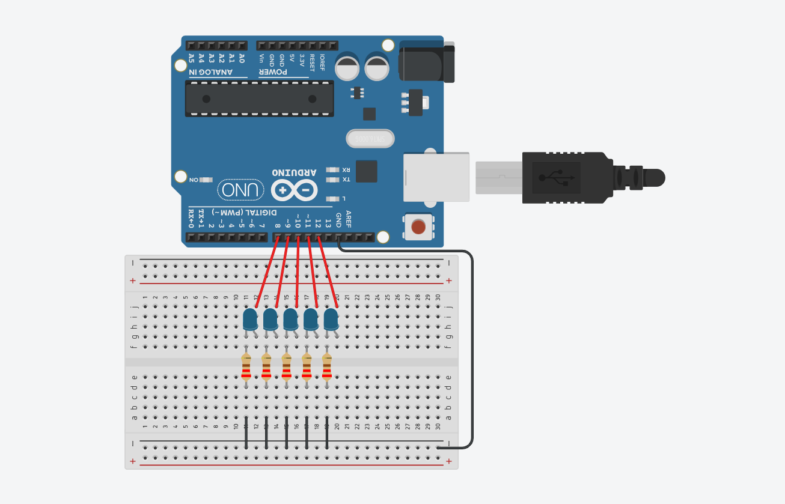

# hand-gesture-arduino-led-control

---

## 📦 Features

- Real-time hand tracking using webcam
- Detects when all fingers are raised
- Sends command to Arduino via serial
- Turns **all LEDs ON** when fingers are open, **OFF** otherwise

---

## 🖥️ Python Side (Hand Tracker)

### Dependencies
Install required libraries:

```bash
pip install -r requirements.txt
```

### Run the Script
Make sure your Arduino is connected and update the COM port in `main.py`:

```python
serial.port = "COM3"  # Replace with your actual COM port
```

Then run:

```bash
python src/main.py
```

This will open your webcam and start gesture detection.

---

## 🔌 Arduino Side

### Hardware
- Arduino UNO (or compatible)
- 5 LEDs + 220Ω resistors
- Jumper wires
- Breadboard

### Pins
Connect LEDs to:
- D8, D9, D10, D11, D12

### Upload Sketch
Open `src/sketch.ino` in the Arduino IDE and upload to your board.

### Wiring Diagram



---

## 🔁 Serial Communication

| Hand Gesture         | Command Sent | LED Action     |
|----------------------|--------------|----------------|
| All fingers raised   | `'1'`        | LEDs ON        |
| Any finger down      | `'0'`        | LEDs OFF       |

---

## 🧠 How It Works

- MediaPipe detects hand landmarks from webcam input
- If all 5 fingers are raised, it sends `'1'` via serial
- Arduino reads the serial and lights up all 5 LEDs
- If any finger is down, it sends `'0'`, turning off the LEDs

---

## 📂 Project Structure

```
├── src/
│   ├── main.py          # Python script (hand tracker)
│   ├── sketch.ino       # Arduino sketch
│   └── assets/
│       └── circuit.png  # Wiring diagram
├── requirements.txt
└── README.md
```

---

## 🧠 Credits

Uses:
- [MediaPipe Hands](https://ai.google.dev/edge/mediapipe/solutions/vision/hand_landmarker)
- [OpenCV](https://opencv.org/)
- Arduino Serial Communication

---

## 📝 License

Licensed under the MIT License. You can use, modify, and share this freely with attribution.
