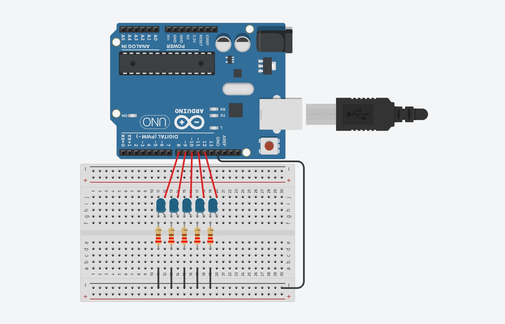

<div align="center">

# GestureLight

[](#)
[](#)
[](#)
[](#)

**Real-time hand tracking utilizing OpenCV and MediaPipe to control an Arduino LED circuit.**

<a href="https://github.com/Huerte/gesturelight/issues">Report Bug</a> · <a href="https://github.com/Huerte/gesturelight/issues">Request Feature</a>

</div>

---

## Table of Contents

- [Demo](#demo)
- [Features](#features)
- [Installation Guide](#installation-guide)
- [Usage](#usage)
- [Project Structure](#project-structure)
- [Troubleshooting](#troubleshooting)
- [Contributing](#contributing)
- [Acknowledgements](#acknowledgements)
- [License](#license)

---

## Demo

> Screenshot demonstrating the project hardware layout.



_This project runs in a terminal environment and relies on webcam access to detect gestures._

---

## Features

hand-gesture-arduino-led-control provides a real-time computer vision script designed for interacting with an external Arduino circuit.  
Built to be responsive, easy to set up, and straightforward.

- **Real-time Hand Tracking:** Uses MediaPipe and OpenCV to accurately detect hands via your webcam.
- **Gesture Detection:** Detects when all five fingers are raised in the frame.
- **Serial Communication:** Translates gesture states into serial commands sent to a connected Arduino.
- **Hardware Integration:** Lights up a sequence of LEDs physically wired to an Arduino UNO when an open hand is shown.

---

## Installation Guide

Follow these steps to install `gesturelight` locally.

### Prerequisites

- **Python 3.x**
- **Arduino IDE**
- **pip** (Python Package Manager)
- **Arduino UNO** (or compatible board), 5 LEDs, 220Ω resistors, jumper wires, breadboard

---

### Step 1: Get the Code

```bash
git clone https://github.com/Huerte/gesturelight.git
cd gesturelight
```

---

### Step 2: Install Dependencies

```bash
pip install -r requirements.txt
```

---

### Step 3: Run

After wiring your Arduino and uploading the sketch:

```bash
python src/main.py
```

---

## Usage

1. Open `src/sketch.ino` in the Arduino IDE and upload it to your board.
2. Ensure you have connected your LEDs correctly (Pins D8, D9, D10, D11, D12).
3. Update the COM port in `src/main.py`: `serial.port = "COM3"` (Replace with your actual COM port).
4. Run `python src/main.py`. This will launch your webcam.
5. Raise all five fingers to light up the LEDs. Close your hand or lower any finger to turn them off.

---

## Project Structure

```
gesturelight/
│
├── src/
│   ├── main.py          # Python script (hand tracker)
│   ├── sketch.ino       # Arduino sketch
│   └── assets/
│       └── circuit.png  # Wiring diagram
├── requirements.txt
└── README.md
```

---

## Troubleshooting

### Common Issues

**Serial Port Not Found**
```
Error: could not open port 'COM3': FileNotFoundError...
```
> **Fix:** Check your Arduino IDE or Device Manager to identify the correct COM port assigned to your board. Update `serial.port` in `src/main.py` accordingly.

> Still stuck? [Open an issue](https://github.com/Huerte/gesturelight/issues) with your error details and environment info.

---

## Contributing

Contributions are welcome and appreciated!

1. Fork the Project
2. Create a Feature Branch (`git checkout -b feature/NewFeature`)
3. Commit Changes (`git commit -m 'Add NewFeature'`)
4. Push to Branch (`git push origin feature/NewFeature`)
5. Open a Pull Request

---

## Acknowledgements

- [MediaPipe Hands](https://ai.google.dev/edge/mediapipe/solutions/vision/hand_landmarker) — Hand tracking and landmark detection.
- [OpenCV](https://opencv.org/) — Real-time computer vision capabilities.

---

## License

Distributed under the **MIT** License. See [`LICENSE`](LICENSE) for details.

---

<div align="center">

&copy; 2026 Huerte. All Rights Reserved.

</div>
